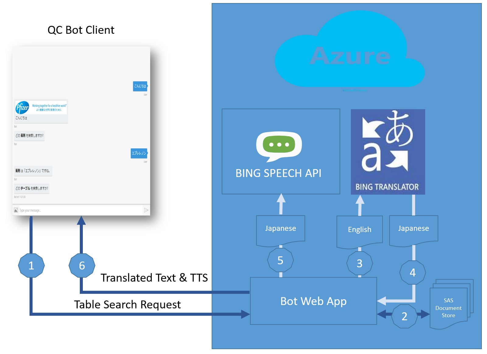
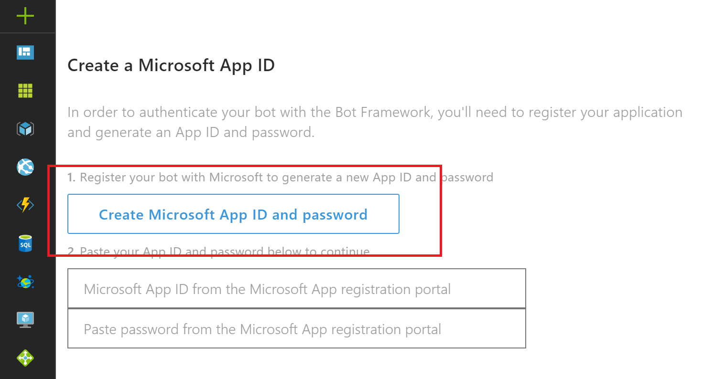
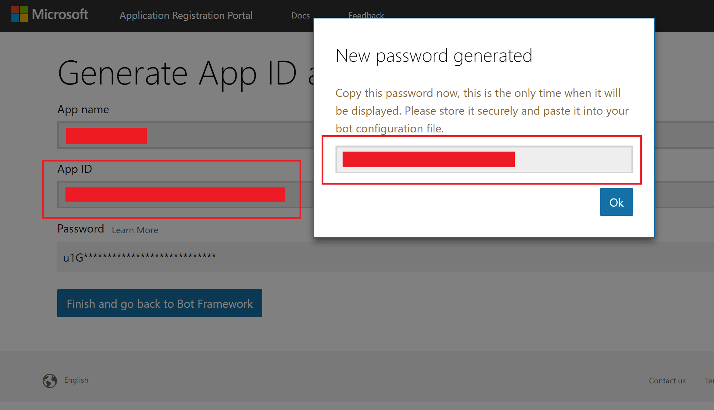
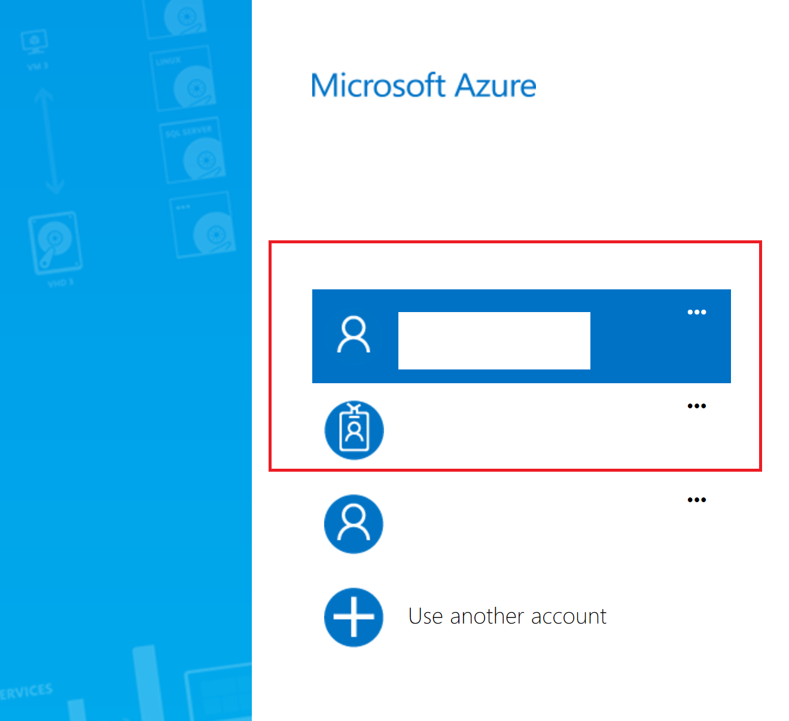
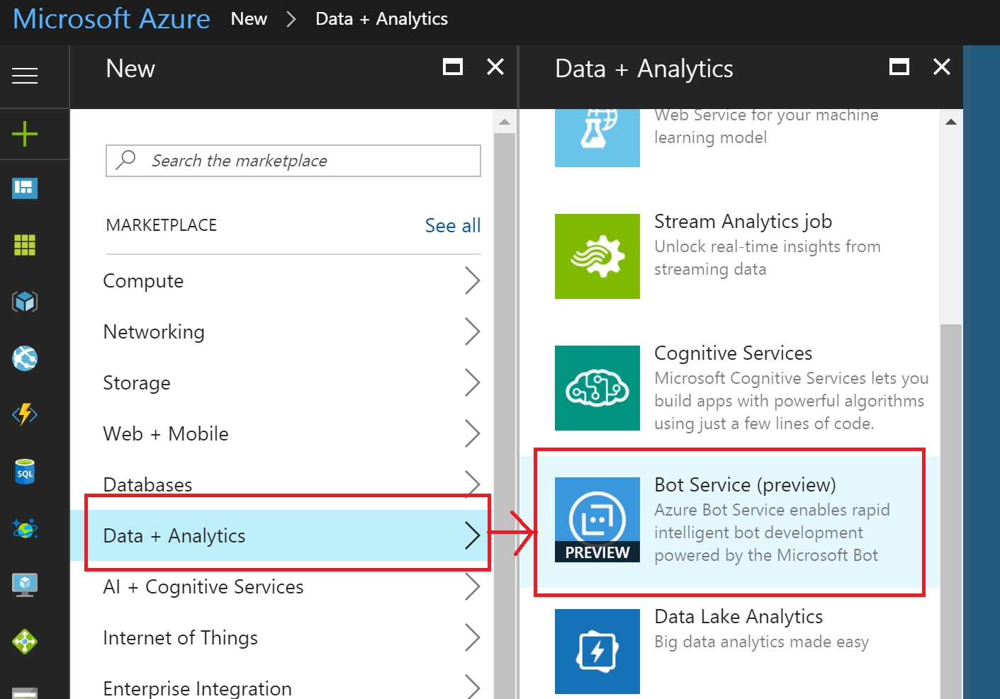
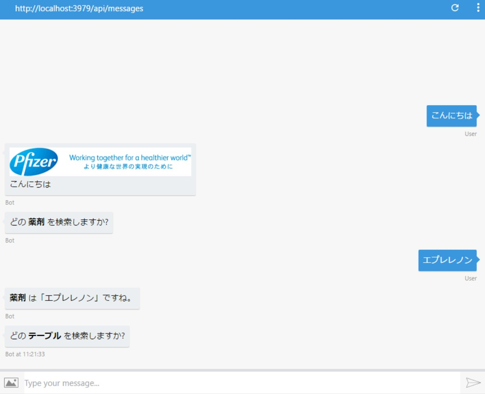
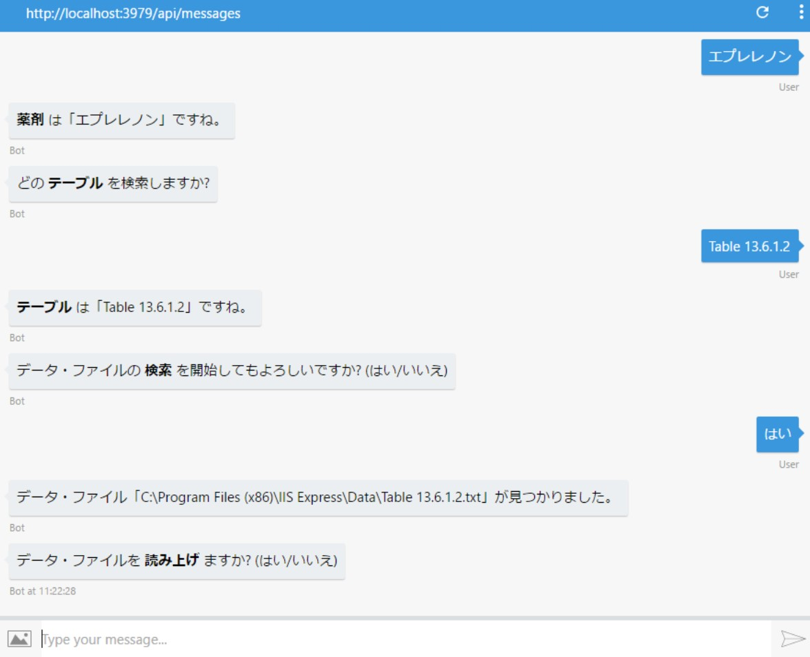
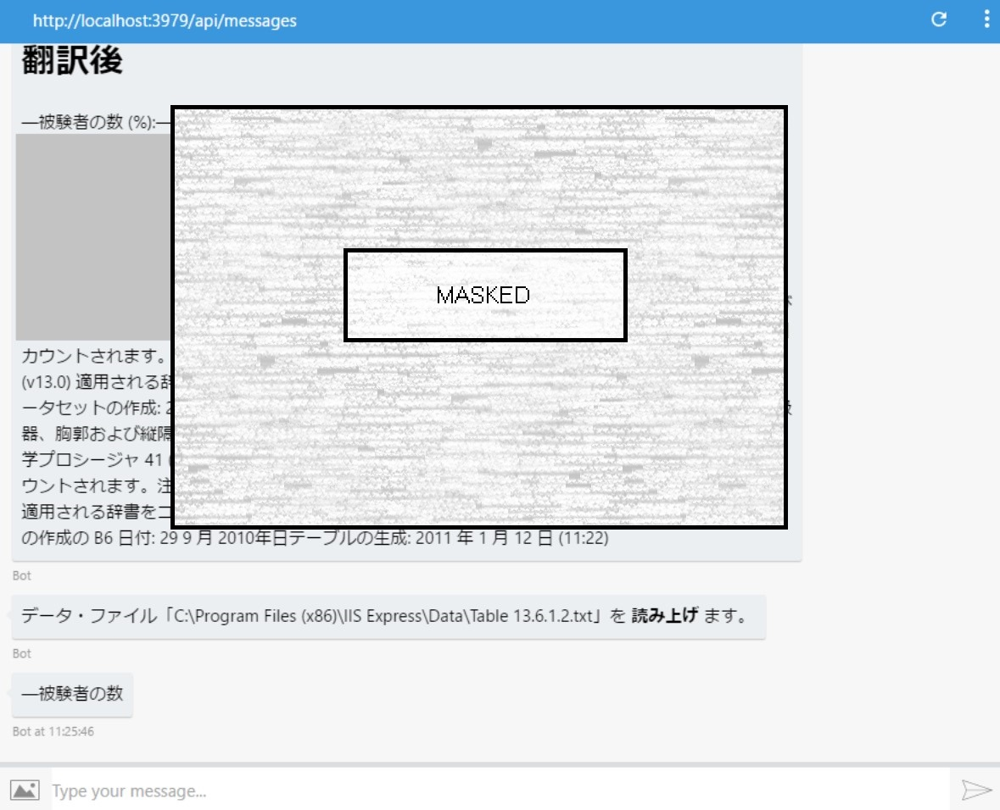
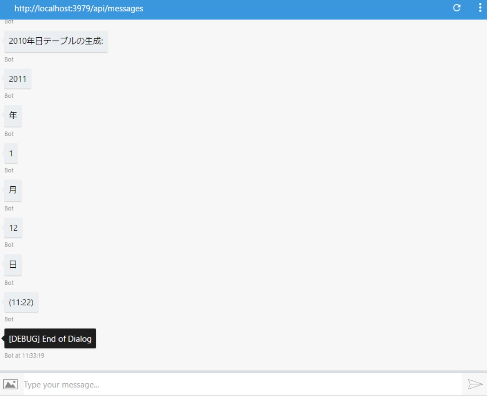

Pfizer has a rigorous testing system where Quality Control Engineers (QC) validate final report values (reports are in Japanese) with their English originals. This is a very time consuming and human-error prone process.

In order to simplify it and make it faster, they developed a Bot using the Microsoft Bot Framework and performed translations using Bing Translation API at real-time.

### Key Technologies Used ##

- [Microsoft Bot Framework](https://dev.botframework.com/) - for creating the Bot which interacted with the testing engineers

- [Microsoft Cognitive Services APIs](https://www.microsoft.com/cognitive-services/en-us/apis) (Language) - for performing real-time translation & Text-To-Speech

- [Microsoft Azure](https://azure.microsoft.com/en-us/) - for hosting the Bot & solution

#### Core Team

Pfizer:
- Yurami Sato, Manager
- Shu Hasumi, Manager
- Masahiro Inoue
- Hideki Yagi

Microsoft DX Japan:
- Parag Paithankar, Technical Evangelist
- Naoki Sato, Technical Evangelist

## Customer profile ##

[Pfizer](http://www.pfizer.co.jp/pfizer/index.html), the world's leading research and development type pharmaceutical company, is one of the leading pharmaceutical companies in the fields of cardiovascular system, central nervous system, analgesic / anti-inflammatory system, musculoskeletal system, infectious disease, urinary system, ophthalmologic system, cancer, endocrine system, vaccine, they are pushing innovative new drugs to the world in a wide range of diseases fields such as rare diseases.

Pfizer has a long history of over 160 years and has long been known as the world's first successful mass production of penicillin in the world.

## Problem statement ##

Once the Drug completes testing, multiple sub-reports are generated from the master test report. This Master report/data source exists in SAS (English version), and data from this report is populated across multiple sub-reports (Japanese). Pfizer has a manually process led by their Quality Control (QC) Engineers of validating values in these sub-reports with the data from the master report. These manual processes are error prone and time consuming. It also involves the process of translating table names/reports from English to Japanese.

## Customer Requirement ##

Pfizer wanted to create an automated experience for their QC engineers in a way that the values are fetched automatically through large custom tables and displayed/spoken out during the verification process. The source tables being in English, also required real-time translation into Japanese. The experience had to be seamless, requiring minimal diversion to the existing process, with improved accuracy.

## Solution ##

In order to provide the expected experience, the team created a Bot which would interact with the QC Engineer in a natural way. It would ask human-like questions (eg. Table number) and seek values being tested. This Bot would also communicate with other components of the Cognitive framework, namely Translation and Text to Speech to provide an end-to-end experience.

- Architecture overview:

  

### Technical Delivery

#### Prerequisites

- Azure Subscription: Azure Subscription is required to access the [Azure Portal](https://portal.azure.com), deploy the Bot & access the language API. You can sign up for a free trial, start your own paid subscription or use your corporate subscription to get started (see below - Step 1)

- Microsoft App ID & Password: This can be obtained after creating the Bot Service on the Azure portal (see below - Step 2-> Add a Bot service to your Azure subscription)



- You will need the new AppID & Password for interfacing with your Bot, please note, the password will be displayed only once, so please copy the ID & Password to a secure location to be used later



- Select C# & Basic, and you are all set! It's time to code your Bot now!

- Similar to the above, you will need keys to access the Translator & Speech APIs respectively. This is obtained by adding the respective services and accessing the "keys" for those APIs. You will only need the first key to access the endpoints (links to sample source are provided below for reference)

### Steps for creating the Bot & accessing the Cognitive Services APIs

Let us now look at the various components of the solution and how to create/code them:

- Step 1-> Create or sign into the Azure portal at https://portal.azure.com using an Azure subscription (you can also create a free trial subscription and use all of the components mentioned below)



- Step 2-> Add a Bot service to your Azure subscription



- Step 3->  Follow steps [here](https://docs.microsoft.com/en-us/bot-framework/dotnet/bot-builder-dotnet-overview) to create your Bot using C# (alternatively, once you create the Bot Service, register for a new App ID & Password) & select C#/Basic Bot, Azure Portal creates a sample downloadable source for you (this is deployed by default to the newly created Bot Service). However, you can download this, edit locally and deploy from GitHub, Visual Studio Team Services, etc. This source is accessible after clicking "Configure Continuous Integration"

- Step 3-> Once your Bot is ready, you need to register your Bot to get the App ID & key at [Bot Framework](https://dev.botframework.com/) portal (this is required to configure various external channels the Bot will be interfacing with, for example, Telegram, Web Chat, Skype, etc.)

- Step 4-> Now, you have your Bot registered and base code ready. Inside your code, look out for the message filtering code (switch (activity.GetActivityType())), this is where you would create a chain of Dialogs which will interact with the user and get respective information (in case of this solution, it asked for Table number). Activity parameter contains the message type, (activity.GetActivityType()), we need to filter for activity type "Message" and start our conversation from there:

```
switch (activity.GetActivityType())
               {
                   case ActivityTypes.Message:
                       await Conversation.SendAsync(activity, () => new TableInputDialog()); // This is the dialog which will handle inputting the table name and chain to the next dialog in the sequence
                       break;

                   case ActivityTypes.ConversationUpdate:
                   case ActivityTypes.ContactRelationUpdate:
                   case ActivityTypes.Typing:
                   case ActivityTypes.DeleteUserData:
                   default:
                       Trace.TraceError($"Unknown activity type ignored: {activity.GetActivityType()}");
                       break;
               }
```

- Step 4-> Once the Table name is obtained, we parse through the original report file from SAS (in PDF & Text formats) and extract the snippet to be compared

- Step 5-> This snippet is then passed to the Bing Translator API for converting from English to Japanese. Sample source for handling basic translation is [here](https://github.com/MicrosoftTranslator/CSharp-WPF-Example). In order to use the translation API, you need to add the Text API service to your Azure subscription

- Step 6-> Once the translation is obtained, it is used to invoke the Text-To-Speech engine to playback to the Quality Control Engineer. This is also available in Azure and needs to be added to the subscription. Sample source to access the endpoint is available [here](https://github.com/Azure-Samples/Cognitive-Speech-TTS)

Following function can be used to invoke the endpoint using your Azure subscription key for Speech API

```
private string HttpPost(string accessUri, string apiKey)
        {
            // Prepare OAuth request
            WebRequest webRequest = WebRequest.Create(accessUri);
            webRequest.Method = "POST";
            webRequest.ContentLength = 0;
            webRequest.Headers["Ocp-Apim-Subscription-Key"] = apiKey;

            using (WebResponse webResponse = webRequest.GetResponse())
            {
                using (Stream stream = webResponse.GetResponseStream())
                {
                    using (MemoryStream ms = new MemoryStream())
                    {
                        byte[] waveBytes = null;
                        int count = 0;
                        do
                        {
                            byte[] buf = new byte[1024];
                            count = stream.Read(buf, 0, 1024);
                            ms.Write(buf, 0, count);
                        } while (stream.CanRead && count > 0);

                        waveBytes = ms.ToArray();

                        return Encoding.UTF8.GetString(waveBytes);
                    }
                }
            }
        }
```


The below steps highlight how the developed customer solution works, step by step:

- Step 1-> QC tester requests for specific Table in the document (English SAS document):

  

- Step 2-> The English document is fetched:

  

- Step 3-> The English document, using Bing Translator API is translated from English to Japanese:

  

- Step 4-> The translated document is parsed and adjusted for Speech input. The bits are displayed in chat and played back in Japanese (TTS) using Cortana:

  

Earlier, this entire process was done manually. The QC engineer opened the SAS document, retrieved the respective table (manually from the large source), translated the corresponding table entry and compared the values with the Japanese versions.

With the QC Bot, and as seen in the above screenshots, QC engineer can easily type in the Table number and the entire post process is automated. Once the TTS starts, the QC engineer can focus on the target values and compare values as they are read out. This also provides an audio-visual confirmation and enables the QC Engineer to perform the tasks quicker and with greater accuracy.

What was interesting about this solution was the ability to resolve a complex business solution with a simple, quick to implement technical solution. Pfizer team was introduced to Azure for the first time and had a first time experience of coding with Bot SDK, Translation & Speech APIs.

Various technical components which were part of the solution are mentioned below (with their respective roles):

## Technical Stack ##

- Cognitive Services APIs:
  These APIs comprised of the Bot Framework APIs enabling the developer to develop the Bot service (using C#). Samples provided as part of Bot Framework helped them to get started on the solution quickly

- Microsoft Bing Translator & Speech (TTS) APIs:
  Bing Translator APIs were used for providing real-time translation & client-side TTS

## Conclusion ##

Microsoft Bot Framework demonstrated how easy it was to create a human-like experience to solve a complex and time consuming task. Using the Bot, the QC engineers were able to get the information quickly & compare it with the report values with improved accuracy. Also, as the solution provided real-time translation & speech playback, it was easier for the QC team to compare the values using audio-visual.
